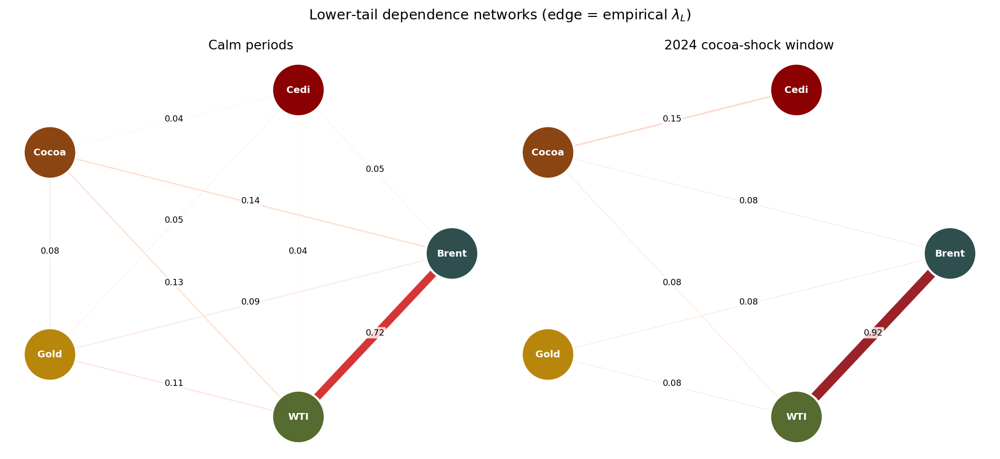
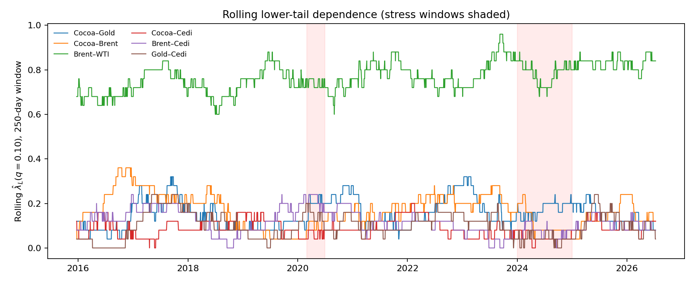

# Tail Dependence and Extreme Commodity Risk in Ghana

**A copula-EVT analysis of cocoa, gold and crude oil, with transmission to the Ghana cedi and macro indicators.**

Do cocoa, gold and crude oil co-move more strongly during extreme market conditions than in normal periods — and does that joint tail risk transmit into Ghanaian exchange-rate, inflation and export-revenue risk? This repository contains a complete, reproducible pipeline answering that question: GARCH-filtered margins, peaks-over-threshold extreme value theory, four copula families with analytic and nonparametric tail-dependence estimation, calm-versus-stress tail-risk networks, rolling co-crash dynamics, an interactive dashboard, and a working-paper draft.

> **Data status: REAL.** All results below use real daily data, January 2015 to July 2026: Yahoo Finance/FRED-sourced commodity futures and the **Bank of Ghana interbank USD/GHS mid-rate** as the cedi series (not the unreliable Yahoo GHS=X proxy — see `outputs/tables/cedi_crosscheck.csv`). The earlier synthetic validation run is retained (`--data synthetic`) as a pipeline-correctness check only; see Appendix A of the paper.

## Headline finding

**We do not find robust evidence that cocoa, gold and crude oil exhibit stronger tail dependence during stress than during calm periods, nor a detectable commodity-to-cedi transmission channel.** Averaged empirical lower-tail dependence is essentially flat from calm to stress (λ̂_L: 0.145 → 0.149 at q=0.05), corroborated by a rolling 250-day t-copula. Of ten pairs tested with Bonferroni correction for multiple comparisons, only one is nominally significant — and it resolves, under a standard robustness check (excluding COVID from the stress definition), to a small-sample artifact rather than a real effect. The one robust, strong pattern in the data is the structural **Brent-WTI linkage** (λ̂_L 0.72-0.86 throughout both regimes) — expected of close substitutes, not evidence of stress contagion. We report this null result transparently: it is corroborated across independent estimators and survives multiple robustness checks, which is what makes it credible.

| | |
|---|---|
|  |  |

## Repository structure

```
src/tailrisk/          Library code
  marginals.py         AR(1)-GJR-GARCH(1,1)-t filtering + PIT
  evt.py               POT/GPD, VaR/ES, Hill, threshold sensitivity, mean excess
  copulas.py           Gaussian / t / Clayton / Gumbel MLE + tail dependence
  networks.py          Rolling co-crash estimation + tail-risk network plots
scripts/
  00_generate_synthetic_data.py   Synthetic demo dataset (seeded, documented)
  01_fetch_real_data.py           Real data via yfinance + World Bank (run locally)
  02_run_pipeline.py              Full analysis → outputs/figures, outputs/tables
  03_build_dashboard.py           Interactive HTML dashboard
data/processed/        Returns/prices (synthetic committed; real generated locally)
outputs/figures        fig0–fig5 (prices, vol, EVT stability, calm-vs-stress,
                       rolling tail dependence, tail networks)
outputs/tables         GARCH, GPD, copula, tail-dependence and network matrices
outputs/dashboard.html Interactive dashboard (heatmaps, rolling λ_L, event timeline)
paper/paper.md         Working-paper draft (methodology complete)
```

## Quickstart

```bash
python -m venv .venv && source .venv/bin/activate
pip install -r requirements.txt

# Reproduce the committed validation run
python scripts/00_generate_synthetic_data.py
python scripts/02_run_pipeline.py
python scripts/03_build_dashboard.py

# Real data (requires internet)
pip install yfinance wbgapi
python scripts/01_fetch_real_data.py
python scripts/02_run_pipeline.py --data real
python scripts/03_build_dashboard.py --data real
```

## Method summary

1. **Marginals.** Each daily return series is filtered by AR(1)-GJR-GARCH(1,1) with Student-t innovations; standardized residuals are mapped to pseudo-uniforms (PIT, then rank-based pseudo-observations) so the copula layer sees approximately i.i.d. uniform margins (IFM / pseudo-MLE).
2. **EVT.** Loss tails of the standardized residuals are fitted with a generalized Pareto distribution above the 90% threshold; ξ̂ is scanned across the 85–97.5% thresholds as a stability check, with the Hill estimator as a semi-parametric cross-check.
3. **Copulas.** Gaussian, Student-t, Clayton and Gumbel copulas are estimated per pair by pseudo-MLE and compared by AIC; tail dependence is reported analytically (from t/Clayton/Gumbel parameters) and nonparametrically (λ̂_L(q) = P(U≤q, V≤q)/q).
4. **Stress & networks.** Ex-ante stress windows (COVID Mar–Jun 2020; calendar-2024 cocoa shock) versus calm subsamples; λ̂_L matrices rendered as weighted networks; 250-day rolling co-crash dynamics.
5. **Transmission.** Daily tail-risk aggregates (joint-exceedance counts, mean rolling λ̂_L) are related to monthly cedi, inflation and export-revenue movements (second-stage extension).

## Data sources and what's committed

Commodity futures (CC=F, GC=F, BZ=F, CL=F) are from Yahoo Finance — fetch-only under Yahoo's terms, **not committed to this repo**; rerun `scripts/01_fetch_real_data.py` to regenerate `data/processed/prices_real.csv` / `returns_real.csv` locally (gitignored). The **cedi series is the Bank of Ghana interbank USD/GHS mid-rate**, sourced from bog.gov.gh time-series workbooks — official public data, **committed under `data/raw/bog/`** with attribution. Monthly CPI (headline YoY) and merchandise exports (f.o.b.) are from the same BoG tables. World Bank `FP.CPI.TOTL.ZG` served as an initial cross-check only.

`scripts/04_integrate_bog.py` performs the integration: it replaces the unreliable Yahoo GHS=X proxy (return correlation with BoG: 0.18; two outright garbage prints identified and documented in `outputs/tables/cedi_crosscheck.csv`), resolves previously-masked crisis dates against BoG evidence, and re-verifies the cedi orientation convention (lower tail = depreciation) end-to-end.

## Publishing this repository to GitHub

```bash
cd tail-dependence-ghana
git remote add origin https://github.com/<your-username>/tail-dependence-ghana.git
git branch -M main
git push -u origin main
```

## Citation

> *Tail Dependence and Extreme Commodity Risk in Ghana: A Copula-EVT Analysis of Cocoa, Gold and Crude Oil.* Working paper, 2026. See `paper/paper.md`.

## License

MIT — see `LICENSE`.
